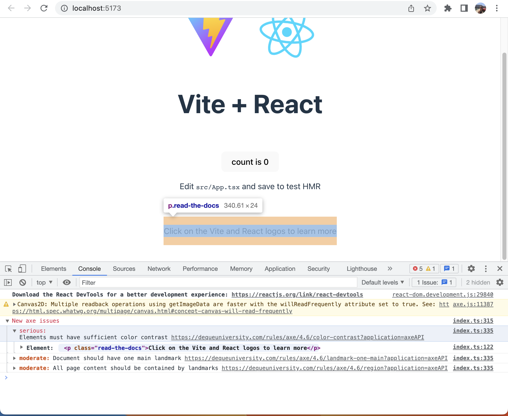
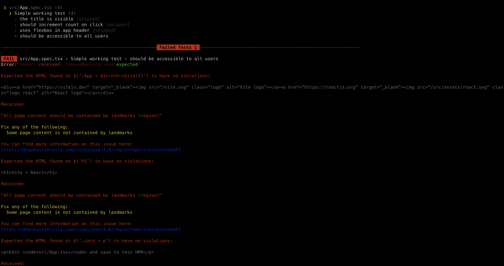
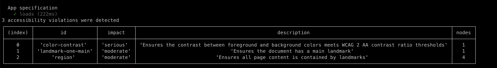
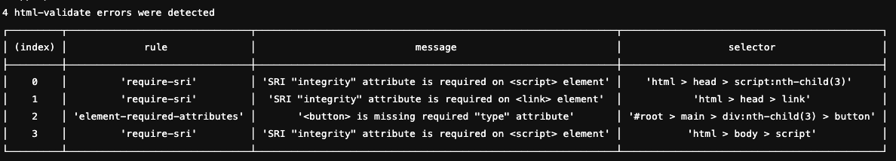

# Axe-core & Html Validate Pipeline Integration

## Intro
While axe-core can be used directly, there are also various projects built on axe-core that make it easy to connect it with your current technology.

Here are just some of the available wrappers:

### Compile time warnings:

* vue-axe
* axe-core/react

### Unit testing

* Jest-axe
* vitest-axe

### End to end testing

* axe-core/playwright
* axe-core/puppeteer
* Cypress-axe

The full list of projects can be found here: https://github.com/dequelabs/axe-core/blob/develop/doc/projects.md

However, there are more projects that are not on the list, so search for "<my-favourite(-test)-framework> axe" and you might find what you need!

## Purpose of this project

In this project, I am testing:

* @axe-core/react for compile-time warnings
* vitest-axe for unit tests
* Cypress-axe (with html-validate plugin) for end to end tests

## Axe-core in the Development Console

The easiest usage is to connect the axe library in all node environments except production, and output the issues to the dev tools console. After only a few setup steps, I got the following feedback in the dev tools:

### Unit tests with JSDOM

In order to test your page for accessibility issues with axe-core, you need to find a way to render your code. There are many ways of doing this. You can either opt to integrate the axe tests into your end-2-end tests (for example using Selenium or Cypress).

But you could also catch the error one step further and integrate axe into your frontend tests. One way of doing this is by using a combination of vitest (a popular test runner optimised for vite projects), (react) testing library (DOM testing library) and a library called vitest-axe, which provides vitest-compatible matchers to test for accessibility.

After configuring vitest-axe, we now have one failing accessibility test and get some of the warnings we saw in the console earlier:

> :warning: Looking closer, we see that two of the warnings we saw in the console are not featured in the test:

One of the *landmark* warnings is not shown because we are only testing the component without the surrounding document.

The *color contrast* warning is not shown, because CSS styles cannot be evaluated for accessibility issues in jsdom. You can find a disclaimer on the jest-axe website. The vitest-axe plugin is based on jest-axe.

What we can see is that even in this small setup, we are already losing two of the warnings about accessibility.

BUT! We can go one step further and add cypress tests to our project, which let us start our dev server and run axe checks on the actual rendered page.

### End-2-End tests with Cypress

Cypress is an easy-to-use framework popular with both QA engineers and above all developers. The tests are run in the browser and are easy to setup up.

Html-Validate provides first-class support for many frameworks, including cypress. So we add that as well.

We now get all three error messages that we saw in the very first example:

Plus some errors from the Html-Validate plugin.

And this is the additional screenshot that Cypress provides:

## Pipeline Integration

Last but not least we can set up a test pipeline, for example in Gitlab, so we are always alerted when accessibility issues have entered our build. Here is an example for a gitlab pipeline file.

Here you can see the build failing because we have issues: 

* Failing End to End tests
* Failing Unit tests

## Conclusion
Browser-rendered test scenarios like Cypress deliver the most accurate tests with axe-core and html-validate
If Cypress is no viable option, we can also use vitest-axe or similar libraries to test the JSDOM.
Aside from automated tests, it is also advisable to use axe-core to output errors to the console in our dev environment.

